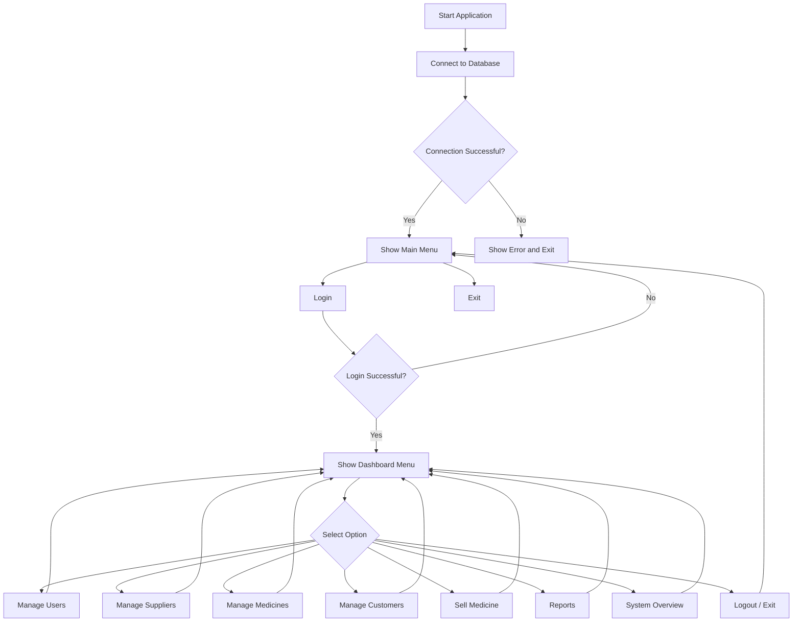
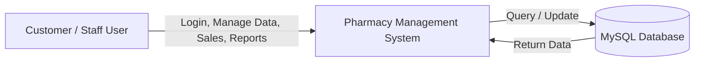
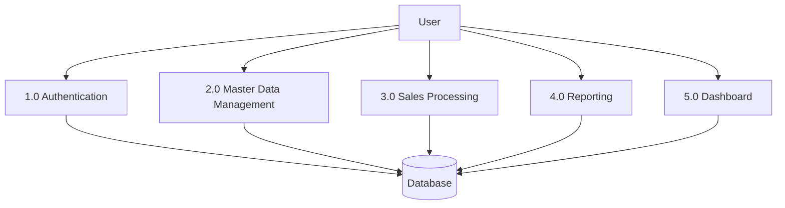
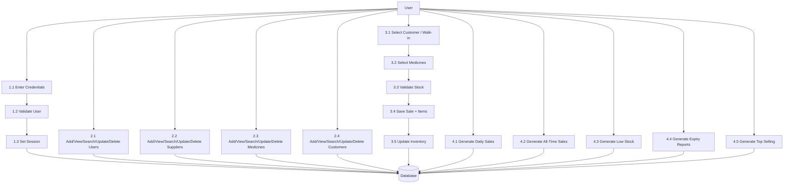

# Pharmacy Management System Design Documentation

## 1. Overview

This document captures the design for the Pharmacy Management System implemented in C/C++ with a MySQL backend. It includes:
- System flowchart
- Main algorithms
- Pseudocode for key modules
- Data Flow Diagrams (DFD) Level 0, Level 1, and Level 2
- Data entities and process descriptions

---

## 2. System Components

### Main Modules
- `main.c` - Program entry, login menu, dashboard loop
- `login.c` / `login.h` - User authentication and session tracking
- `users.c` / `users.h` - Manage staff users (CRUD)
- `supplier.c` / `supplier.h` - Manage medicine suppliers (CRUD)
- `medicine.c` / `medicine.h` - Manage medicines and inventory (CRUD)
- `customer.c` / `customer.h` - Manage customers (CRUD)
- `sale.c` / `sale.h` - Create sales, cart handling, stock decrement
- `report.c` / `report.h` - Generate sales, stock, and expiry reports
- `dashboard_report.c` / `dashboard_report.h` - System overview dashboard
- `database.c` / `database.h` - Database connection management
- `ui.c` / `ui.h` - Display helpers and formatting functions

### Database Tables
- `users(user_id, full_name, username, password, phone, role, created_at)`
- `customers(customer_id, full_name, phone, email, address, created_at)`
- `suppliers(supplier_id, company_name, contact_person, phone, email, address, created_at)`
- `medicines(medicine_id, medicine_name, category, supplier_id, buy_price, sell_price, quantity, expiry_date, created_at)`
- `sales(sale_id, customer_id, user_id, sale_date, grand_total)`
- `sale_items(sale_item_id, sale_id, medicine_id, quantity, price, subtotal)`

---

## 3. Project Flowchart

### 3.1 Flowchart (Mermaid)



### 3.2 Flowchart Explanation

- The application begins by connecting to the database.
- If the database connection fails, the system exits.
- The user must log in before accessing the dashboard.
- The dashboard presents menu options for CRUD operations, sales, reports, and logout.
- Each selected module returns the user back to the dashboard.
- Logout returns to the main menu.

---

## 4. Main Algorithms

### 4.1 Login Algorithm

1. Prompt the user for username and password.
2. Query the `users` table for matching credentials.
3. If user exists, save `currentUserId` and grant access.
4. If no match, deny login and return to the main menu.

### 4.2 CRUD Algorithm for Entities

For Users, Suppliers, Medicines, and Customers:
1. Display a submenu with options: Add, View, Search, Update, Delete, Back.
2. For Add: gather input, execute INSERT SQL.
3. For View: execute SELECT SQL and print rows.
4. For Search: accept a keyword and execute SELECT with LIKE.
5. For Update: present available records, prompt for ID, prompt for field and new value, execute UPDATE SQL.
6. For Delete: present available records, prompt for ID, execute DELETE SQL.
7. Return to the submenu until the user chooses Back.

### 4.3 Sell Medicine Algorithm

1. Display customer list and allow selecting a registered customer or walk-in.
2. Loop to add medicine items to the cart:
   - Display medicines and stock.
   - Select medicine ID and requested quantity.
   - Verify stock availability.
   - Add item to cart and accumulate subtotal.
3. Confirm sale once the cart is complete.
4. Start a database transaction.
5. Insert a new `sales` row.
6. Insert one `sale_items` row for each cart item.
7. Update `medicines.quantity` for each sold item.
8. Commit transaction on success or rollback on any failure.

### 4.4 Report Generation Algorithm

For each report:
1. Build the SQL query based on user input or current date.
2. Execute the SQL query.
3. Fetch results and print formatted output.
4. For detailed reports, list each sale or medicine row.

---

## 5. Pseudocode

### 5.1 Main Program Pseudocode

```text
START
connectDB()
IF not connected THEN
    print "Database Connection Failed"
    EXIT
END IF
WHILE true DO
    showMainMenu()
    choice = readInteger()
    SWITCH choice
        CASE 1:
            IF login() THEN
                print "Login successful"
                dashboard()
            ELSE
                print "Invalid username or password"
            END IF
            BREAK
        CASE 2:
            print "Exiting the system"
            disconnectDB()
            EXIT
        DEFAULT:
            print "Invalid choice"
    END SWITCH
END WHILE
END
```

### 5.2 Dashboard Pseudocode

```text
FUNCTION dashboard()
    WHILE true DO
        printDashboardMenu()
        choice = readInteger()
        SWITCH choice
            CASE 1: usersMenu()
            CASE 2: medicineMenu()
            CASE 3: supplierMenu()
            CASE 4: customerMenu()
            CASE 5: saleMenu()
            CASE 6: reportMenu()
            CASE 7: systemOverview()
            CASE 8: print "Logged out"; RETURN
            DEFAULT: print "Invalid choice"
        END SWITCH
    END WHILE
END FUNCTION
```

### 5.3 Generic CRUD Module Pseudocode

```text
FUNCTION entityMenu(entityName)
    WHILE true DO
        print "1. Add"
        print "2. View"
        print "3. Search"
        print "4. Update"
        print "5. Delete"
        print "6. Back"
        choice = readInteger()
        SWITCH choice
            CASE 1: addEntity()
            CASE 2: viewEntity()
            CASE 3: searchEntity()
            CASE 4: updateEntity()
            CASE 5: deleteEntity()
            CASE 6: RETURN
            DEFAULT: print "Invalid choice"
        END SWITCH
    END WHILE
END FUNCTION
```

### 5.4 Sale Processing Pseudocode

```text
FUNCTION sellMedicine()
    showCustomerListShort()
    customerId = readIntegerOrZero()
    IF customerId != 0 THEN
        IF customerDoesNotExist(customerId) THEN
            print "No customer found"
            RETURN
        END IF
    END IF
    cart = []
    total = 0
    DO
        showMedicineListShort()
        medicineId = readInteger()
        qty = readInteger()
        stock = getMedicineStock(medicineId)
        IF qty <= 0 OR qty > stock THEN
            print "Invalid quantity"
            CONTINUE
        END IF
        addToCart(cart, medicineId, qty, price)
        total += qty * price
        more = askYesNo("Add another item?")
    WHILE more
    IF cart empty THEN
        print "Sale cancelled"
        RETURN
    END IF
    printSaleSummary(total)
    confirm = askYesNo("Confirm sale?")
    IF not confirm THEN
        print "Sale cancelled"
        RETURN
    END IF
    START TRANSACTION
    saleId = insertSale(customerId, currentUserId, total)
    FOR each item in cart DO
        insertSaleItem(saleId, item)
        updateMedicineStock(item)
        IF error THEN
            ROLLBACK
            print "Sale failed"
            RETURN
        END IF
    END FOR
    COMMIT
    print "Sale completed"
END FUNCTION
```

### 5.5 Report Menu Pseudocode

```text
FUNCTION reportMenu()
    WHILE true DO
        print "1. Daily Sales"
        print "2. All-Time Sales"
        print "3. Low Stock"
        print "4. Expiring Soon"
        print "5. Top Selling Medicines"
        print "6. Back"
        choice = readInteger()
        SWITCH choice
            CASE 1: dailySalesReport()
            CASE 2: totalSalesReport()
            CASE 3: lowStockReport()
            CASE 4: expiringSoonReport()
            CASE 5: topSellingMedicines()
            CASE 6: RETURN
            DEFAULT: print "Invalid choice"
        END SWITCH
    END WHILE
END FUNCTION
```

---

## 6. Data Flow Diagrams

### 6.1 DFD Level 0 (Context Diagram)



### 6.2 DFD Level 1



### 6.3 DFD Level 2



---

## 7. Other Required Documents

### 7.1 Functional Requirements

- The system must authenticate users before allowing access.
- The system must allow adding, viewing, searching, updating, and deleting:
  - users
  - suppliers
  - medicines
  - customers
- The system must allow creating sales with multiple medicine items.
- The system must update medicine stock automatically after each sale.
- The system must support walk-in customers with `customer_id = NULL`.
- The system must generate the following reports:
  - daily sales
  - all-time sales
  - low stock
  - expiring soon
  - top selling medicines
- The system must provide a dashboard overview of totals.

### 7.2 Non-Functional Requirements

- The system must run on Windows console.
- The system must connect to a local MySQL database.
- The system must handle invalid input gracefully.
- The system should use transactions for sales so stock and sale data remain consistent.

### 7.3 Database Relationship Summary

- `suppliers` → `medicines` : each medicine belongs to one supplier.
- `customers` → `sales` : each sale may belong to one customer or be walk-in.
- `users` → `sales` : each sale is created by one logged-in user.
- `sales` → `sale_items` : each sale can have many line items.
- `medicines` → `sale_items` : each sale item refers to one medicine.

### 7.4 Glossary

- `Walk-in customer`: Sale with no registered customer, represented by `customer_id = 0` or `NULL`.
- `Cart`: Temporary list of medicines and quantities before finalizing a sale.
- `Grand Total`: Sum of all item subtotals in a sale.
- `Transaction`: Database commit/rollback mechanism used during sale creation.

---

## 8. How to Use This Document

- Use the flowchart and DFD diagrams to explain system behavior and data interactions.
- Use the algorithms and pseudocode to guide code review, updates, or new feature design.
- Use the functional and non-functional requirements as a checklist when validating system behavior.

---

## 9. Notes

Because this is a console application, the diagrams and pseudocode are intentionally centered around menu-driven flow and sequential user input.

For any future GUI or web port, the same DFD components and data entities remain valid, but the presentation layer would change.
